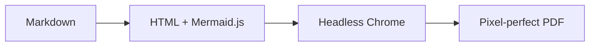

<p align="center">
  <h1 align="center">SnapMD</h1>
  <p align="center">Pixel-perfect Markdown to PDF — with full Mermaid diagram support.</p>
</p>

---

Other Markdown-to-PDF tools parse your document as flat text, breaking Mermaid diagrams, custom styles, and anything that needs a real browser to render. **SnapMD takes a different approach**: it renders your Markdown in a headless Chromium instance — the same engine behind Chrome — and prints it to PDF exactly as it looks.

## Features

### Export to PDF

Convert any Markdown file to a clean, print-ready PDF in one click. Headings, code blocks, tables, images, links — everything renders faithfully.

- Open any `.md` file → <kbd>Cmd+Shift+P</kbd> → `SnapMD: Export to PDF`
- Or click the **PDF icon** in the editor title bar
- Or **right-click** in the editor → `SnapMD: Export to PDF`

### Mermaid Diagram Support

Mermaid code blocks are rendered as real SVG diagrams in your PDF — flowcharts, sequence diagrams, pie charts, Gantt charts, and more.

````markdown

````

### Live Preview

Preview your rendered Markdown in a side panel — with Mermaid diagrams — before exporting.

- <kbd>Cmd+Shift+P</kbd> → `SnapMD: Preview Markdown`
- Edits update the preview in real time (~300ms debounce)
- Click **Export to PDF** directly from the preview toolbar

### Relative Image Support

Images with relative paths (e.g., ``) resolve correctly from your file's directory. No broken images in your PDF.

---

## Requirements

SnapMD requires a Chromium-based browser installed on your system. Any of these will work:

- [Google Chrome](https://www.google.com/chrome/)
- [Chromium](https://www.chromium.org/)
- [Microsoft Edge](https://www.microsoft.com/edge)
- [Brave](https://brave.com/)

SnapMD auto-detects your browser. If detection fails, set the path manually (see [Settings](#settings) below).

---

## Commands

| Command | Description |
|---------|-------------|
| `SnapMD: Export to PDF` | Export the current Markdown file to PDF |
| `SnapMD: Preview Markdown` | Open a live-rendered preview panel |

Both commands are available via:
- **Command Palette** (<kbd>Cmd+Shift+P</kbd> / <kbd>Ctrl+Shift+P</kbd>)
- **Editor title bar** icons (when a `.md` file is open)
- **Right-click context menu** in the editor

---

## Settings

Configure SnapMD in your VS Code settings (`settings.json` or the Settings UI):

| Setting | Default | Description |
|---------|---------|-------------|
| `snapmd.chromePath` | `""` (auto-detect) | Absolute path to a Chrome/Chromium executable |
| `snapmd.pdfFormat` | `"A4"` | Paper size: `A4`, `Letter`, `Legal`, `A3`, `A5`, `Tabloid` |
| `snapmd.printBackground` | `true` | Include background colors and images in the PDF |
| `snapmd.mermaidTimeout` | `10000` | Max time (ms) to wait for Mermaid diagrams to render |

### Example: Custom Chrome path

```json
{
  "snapmd.chromePath": "/usr/bin/google-chrome-stable"
}
```

---

## How It Works

```
┌─────────────┐     ┌──────────────┐     ┌──────────────┐     ┌─────────┐
│  Markdown    │────>│  markdown-it │────>│   Headless   │────>│   PDF   │
│  (.md file)  │     │  + Mermaid   │     │   Chromium   │     │  file   │
└─────────────┘     └──────────────┘     └──────────────┘     └─────────┘
                     Parse & render        Load as real          Print
                     to full HTML          web page              to PDF
```

1. **Parse** — markdown-it converts your Markdown to HTML, with a custom plugin that transforms ```` ```mermaid ```` blocks into `<div class="mermaid">` elements
2. **Render** — A headless Chromium instance loads the HTML as a real web page, fetching Mermaid.js from CDN to render diagrams as SVGs
3. **Print** — Chromium's built-in PDF printer captures the fully-rendered page with precise layout

---

## FAQ

<details>
<summary><strong>Mermaid diagrams aren't rendering in my PDF</strong></summary>

Mermaid.js is loaded from a CDN at render time. Ensure you have an internet connection. If diagrams still fail, try increasing the timeout:

```json
{
  "snapmd.mermaidTimeout": 20000
}
```

</details>

<details>
<summary><strong>"Could not find a Chrome/Chromium installation"</strong></summary>

SnapMD needs a Chromium-based browser. Either:
1. Install [Google Chrome](https://www.google.com/chrome/)
2. Set the path manually: `"snapmd.chromePath": "/path/to/chrome"`
3. Set the `CHROME_PATH` environment variable

</details>

<details>
<summary><strong>Can I use this offline?</strong></summary>

PDF export works offline for standard Markdown. However, Mermaid diagrams require an internet connection since Mermaid.js is loaded from a CDN. Diagrams will be skipped (not block the export) if the CDN is unreachable.

</details>

---

## Release Notes

### 0.0.1

- Initial release
- Export Markdown to PDF with Mermaid diagram support
- Live preview panel with real-time updates
- Cross-platform Chrome/Chromium/Edge/Brave auto-detection
- Configurable paper format, margins, and background printing

---

## License

[MIT](LICENSE)
